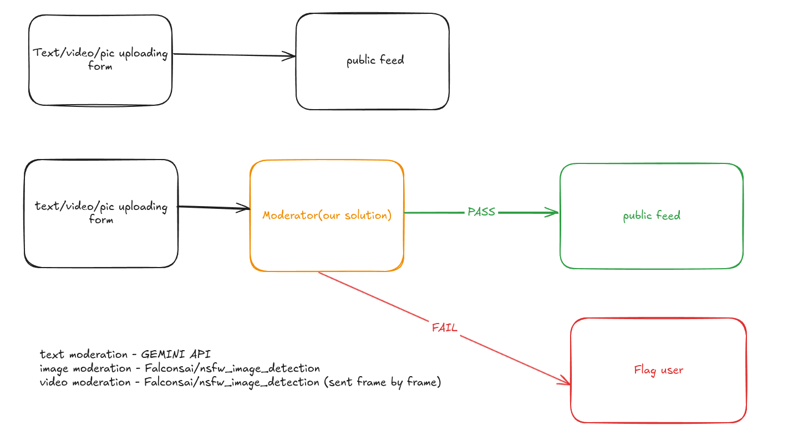

## Overview

This frontend service is built using Next.js and provides a user interface for interacting with the backend service. It supports fetching and displaying user activity logs and moderating text. The application is designed to work seamlessly with the backend service.

---


## Prototype

To play with it: http://52.66.251.56:3000/?

if you find any significant errors report to sriram6132@gmail.com

---

## Features

- Display user activity logs
- Interface for text moderation
- Dynamic and responsive UI

---

## Prerequisites

1. Node.js (v18 or later)
2. npm or yarn (for dependency management)

---

## Installation

1. Clone the repository:
   ```bash
   git clone <repository-url>
   cd <repository-folder>
   ```

2. Install dependencies:
   ```bash
   npm install
   # or
   yarn install
   ```

3. Set up the `.env.local` file:
   Create a `.env.local` file in the root directory with the following variables:
   ```env
   NEXT_PUBLIC_BACKEND_URL=http://<backend-host>:<backend-port>
   ```

4. Start the development server:
   ```bash
   npm run dev
   # or
   yarn dev
   ```

5. Access the application at `http://localhost:3000`.

---

## Deployment

### On EC2

1. SSH into the EC2 instance.
2. Install Node.js if not already installed.
3. Follow the "Installation" steps above.
4. Start the server in production mode:
   ```bash
   npm run build
   npm start
   ```

### Using PM2

1. Install PM2 globally if not already installed:
   ```bash
   npm install -g pm2
   ```

2. Start the frontend service using PM2:
   ```bash
   pm2 start npm --name "frontend-service" -- start
   ```

3. Check the status of the service:
   ```bash
   pm2 status
   ```

---

## Environment Variables

| Variable                  | Description                                   |
|---------------------------|-----------------------------------------------|
| `NEXT_PUBLIC_BACKEND_URL` | Base URL of the backend service (required).  |

---

## Troubleshooting

1. **Application not starting?**
   - Check if `.env.local` is correctly configured.

2. **API errors?**
   - Verify the `NEXT_PUBLIC_BACKEND_URL` in `.env.local`.
   - Ensure the backend service is running and accessible.

3. **PM2 issues?**
   - Use `pm2 logs` to debug.

---

## Contributing

1. Fork the repository.
2. Create a new branch:
   ```bash
   git checkout -b feature-name
   ```
3. Make your changes and commit them:
   ```bash
   git commit -m "Add a new feature"
   ```
4. Push to your branch:
   ```bash
   git push origin feature-name
   ```
5. Open a pull request on GitHub.

---

## License

This project is licensed under the MIT License. See the LICENSE file for details.

